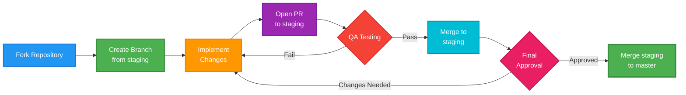

# 🤝 Contributing to PSITS (UC Main)

Thank you for your interest in contributing! While this repository is publicly viewable, contributions are limited to the official PSITS UC Main developers team. Please read this guide before opening a Pull Request.

- View policy and permissions: see [LICENSE.md](./LICENSE.md)
- Community standards: see [CODE_OF_CONDUCT.md](./CODE_OF_CONDUCT.md)

## 👤 Who Can Contribute

- Only authorized **PSITS UC Main developers** may contribute code.
- The public may view the source but must not modify, redistribute, or use it (see [LICENSE.md](./LICENSE.md)).

## 🔀 Branching & Workflow

We use a simple workflow: **master + staging + feature branches**.

**Workflow Steps:**

1. **Fork** the repository to your personal GitHub account.
2. In your fork, **create a new branch from `staging`**.
3. Implement your changes on that branch.
4. **Open a Pull Request (PR) targeting `staging`** in the original repository.
5. **QA tests** features in the staging environment.
6. If approved, changes are **merged from `staging` to `master`**.



### 🏷️ Branch Naming

Use clear, conventional prefixes:

- `feat/your-feature`
- `fix/bug-description`
- `refactor/area`
- `docs/section`
- Optionally: `chore/`, `perf/`, `ci/`, `test/`, `security/`

## 📝 Commit Style (Conventional Commits)

Prefix your commits with a type and short subject:

- `feat: add membership approval flow`
- `fix: correct order receipt rendering`
- `refactor: streamline event controller`
- `docs: update README tech stack`
- Optional types: `chore`, `perf`, `ci`, `test`, `security`

Keep messages concise and descriptive. Use imperative mood (e.g., "add", "fix").

## ✅ Pull Request Rules

- **Target branch:** `staging`
- **Approvals:** At least **1 reviewer** must approve before merge
- **Merging:** Use standard merge or squash per maintainer guidance
- **No direct pushes to `master`**
- Provide a clear PR description (scope, changes, any risks)

## 🧪 Build & Test Before PR

Build and test both client and server locally before opening a PR. Refer to each package's `package.json` for exact commands.

Recommended flow:

### 💻 Client-side

- Development (iterate locally):

```bash
cd client-side
npm run dev
```

- Pre-PR production sanity (test build output):

```bash
npm run build
npm run preview
```

### 🖥️ Server-side

- Development (iterate locally with hot reload):

```bash
cd server-side
npm run dev
```

- Pre-PR production sanity (run compiled code):

```bash
npm run build
npm start
```

Ensure changes run cleanly in development and also work in the production build without errors.

## 🔑 Environment Secrets

- **Request** `.env` files from project leads.
- **Never commit** secrets or `.env` files.
- **Never share** credentials or environment values publicly.

## 🔒 Security & Data Privacy

This platform handles sensitive student data (personal information, payment details, attendance records).

- Follow secure coding practices.
- Do not log or expose sensitive data.
- Report suspected security issues privately to project leads.

## 💬 Issues & Discussions

- If you need to propose work, coordinate with project leads.

## 📫 Contact

- Email: **psitsucmain2025@gmail.com**
- Facebook Page: https://www.facebook.com/PSITS.UCmain

## 📜 License Alignment

By contributing, you agree to the policy in [LICENSE.md](./LICENSE.md). Only authorized PSITS UC Main developers may use, modify, or distribute the code. Public viewing is permitted; external modification or redistribution is prohibited.
